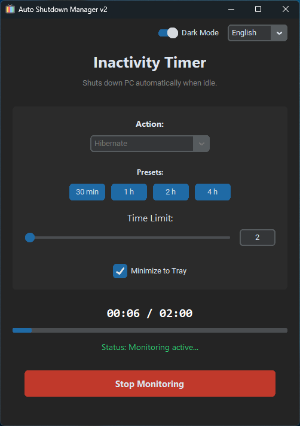
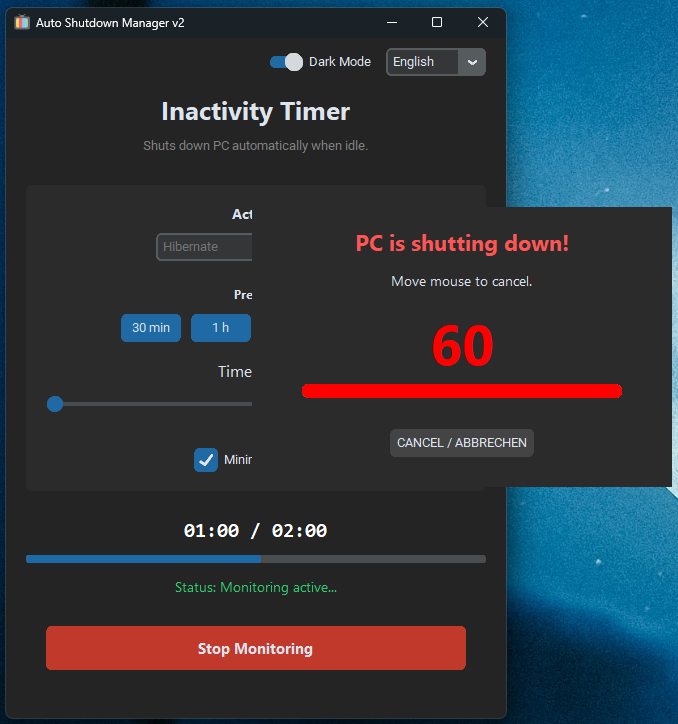

# Auto Shutdown Manager

[](https://www.python.org/)
[](https://www.microsoft.com/windows)
[](LICENSE)
[](https://github.com/x3kim/auto-shutdown-manager/releases)
[](https://github.com/x3kim/auto-shutdown-manager/releases)

## 📖 Description

**Auto Shutdown Manager** is a user-friendly Windows desktop application that automatically shuts down, restarts, hibernates, or puts your PC to sleep after a period of inactivity (no mouse/keyboard input).

Perfect for:

- Preventing forgetting to shut down during work/breaks
- Power management in offices/home setups
- Timed auto-power-off for security/energy saving

## 💡 Why I Built This App (vs. Windows Timers)

I often fall asleep during movie nights – PC runs all night! Windows has no simple "idle timer" for this, and built-in idle ignores media:

> "Windows‑Idle‑Events are counterproductive here – they prevent shutdown during playback. My script simply watches **real input** (mouse/keyboard)."

**Key Advantage**: Still awake after time? Just wiggle your wireless mouse/remote (no getting up!) → Timer resets instantly, keep watching! No manual stop needed.

Features a simple UI, live progress tracking, system tray support, and multi-language (DE/EN).

## ✨ Features

- **Idle Time Monitoring**: Real-time tracking of inactivity using Windows API
- **Configurable Timer**: Slider (1-480 minutes) + presets (30min, 1h, 2h, 4h)
- **Power Actions**: Shutdown, Restart, Hibernate, Sleep
- **Warning Dialog**: 60s countdown with progress bar, sound alerts, auto-cancel if active
- **System Tray**: Minimize to tray, notifications, quick open/exit
- **Keep-Awake**: Prevents sleep/standby during monitoring
- **Modern UI**: CustomTkinter with dark/light mode toggle
- **Persistent Settings**: Saves config to `settings.json`
- **Multi-Language**: German/English (extensible via JSON)
- **EXE-Ready**: PyInstaller compatible with bundled assets/locales
- **Fallbacks**: Auto-generates icon if missing, graceful lang errors

## 📸 Screenshots




## 🚀 Quick Start

### Prerequisites

- Python 3.8+
- Windows 10/11

### Download EXE (Recommended - No Python needed)

Download the latest `AutoShutdownManager.exe` from [GitHub Releases](https://github.com/x3kim/auto-shutdown-manager/releases).

### Development Installation

1. Clone/Download the repo
2. Install dependencies:

   ```bash
   pip install -r requirements.txt
   ```

3. Run:

   ```bash
   python main.py
   ```

### Building Standalone EXE

#### Local Build
```bash
pip install -r requirements.txt
pyinstaller build.spec
```
EXE in `dist/AutoShutdownManager.exe`.

#### GitHub Builds
- **Push to `main`**: Download EXE from [Actions Artifacts](https://github.com/x3kim/auto-shutdown-manager/actions).
- **Tag push (e.g. `v2.0.0`)**: Auto-released in [Releases](https://github.com/x3kim/auto-shutdown-manager/releases/latest) with EXE + changelog.

## 📋 Usage

1. Launch `main.py`
2. Select **Action** (Shutdown/Restart/etc.)
3. Set **time limit** via slider/presets/entry
4. Toggle **Minimize to Tray** (optional)
5. Click **START** → Live progress shows idle time
6. When limit reached: Warning dialog appears (60s countdown)
7. Move mouse/type to cancel → Or auto-executes action

**Pro Tip**: Enable tray minimize for background use.

## ⚙️ Configuration

Settings auto-saved to `settings.json`:

```json
{
    "language": "en",
    "target_minutes": 60,
    "action": "shutdown",
    "appearance_mode": "Dark",
    "minimize_to_tray": true
}
```

## 🌐 Localization

- Add new langs: Copy + translate keys
- Keys used: `HEADER_TITLE`, `STATUS_ACTIVE`, etc. (see code)

## 🛠️ Troubleshooting

- **No tray icon?** Install pystray + Pillow
- **EXE issues?** Use `--add-data` for assets/locales

## 🤝 Contributing

1. Fork & PR
2. Add features/tests
3. Update locales/README

## 📄 License

MIT - See [LICENSE](LICENSE)

---

*Built with ❤️ for myself and everybody else*
